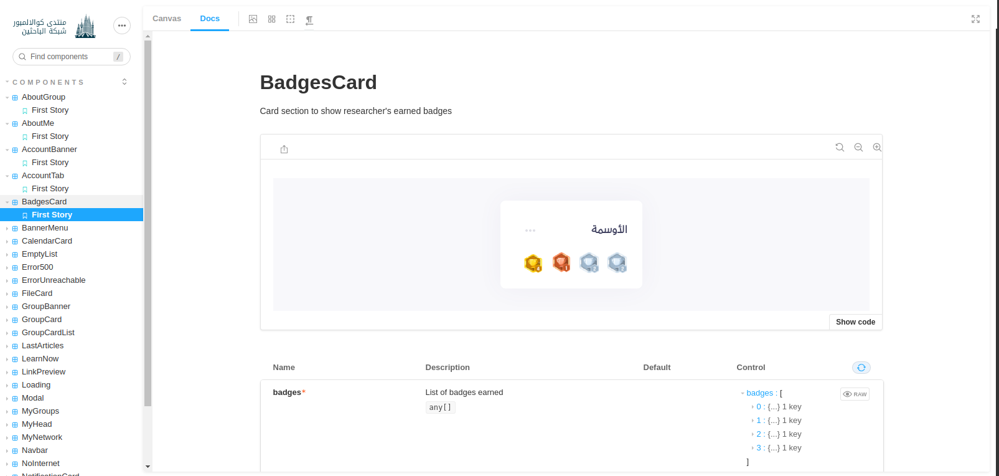
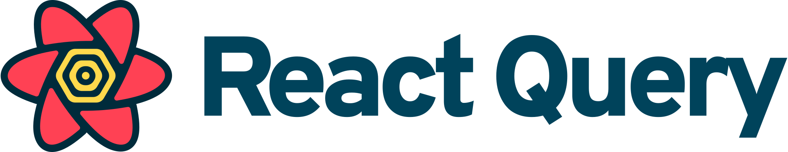

<h1 align="center">
  <br>
 
  <br>
    Eenar UI
  <br>
</h1>

<h4 align="center">Eenar UI t is one of <a href="http://researcher.eenar.io/" target="_blank">Cleverzone Company</a>'s  projects.</h4>


<p align="center">
    <a href="#About-this-project">About this project</a> •
    <a href="#Installation">Installation</a> •
    <a href="#Configuration">Configuration</a> •
    <a href="#Depoyment">Depoyment</a> •
    <a href="#Documentation">Documentation</a> •
    <a href="#Built-with">Built With</a> •
    <a href="#Organization">Organization</a>
</p><br/>

##  About this Project
This is the User Interface of the platform Eenar  
<br/><br/>


## Installation

To clone and run this application, you'll need [Git](https://git-scm.com) , [Node.js](https://nodejs.org/en/download/) [Yarn](https://yarnpkg.com/) installed on your computer. From your command line:

```bash
# Clone this repository
$ git clone https://github.com/cleverZone/Eenar-researcher.git

# Go into the repository
$ cd Eenar-researcher

# Install dependencies
$ yarn install
```
<br/><br/>

## Configuration

before you run the application you have to configure the environment variable of the api endpoint "NEXT_PUBLIC_API_URL" :

```bash
# Creating env.local for local environment variables
$ touch .env.local

# Updating .env.local with the value of NEXT_PUBLIC_API_URL
$  echo NEXT_PUBLIC_API_URL=YOUR_API_ENDPOINT >> .env.local

```
<br/>

Now You can Run the application with:
```bash
$ yarn dev
```
<br/><br/>

## Depoyment

<h3>With node</h3>

```bash
#Build the application
$ yarn build

#Lunch the application in localhost:3000
$ yarn stary
```
<h3>With Docker</h3>

```bash
#Creating the application's container
$ yarn build-docker

#Running the container (the app will be on localhost:3000)
$ yarn run-docker
``` 
<br/><br/>

## Documentation
to access to the documantation:

```bash
#lunch the application's documentation on localhost:9001
$ yarn storybook
```
You will see a screen like:
<br/><br/>

<br/><br/>

## Built With
This project has been developed mainly with:
<div style="display:flex;flex-wrap:wrap;align-items:center;width:100%";>
    
     
    
    
    
    
</div>
<br/><br/>

## Organization
<h4><a href="">Cleverzone.io</a></h4>
<p>
    EffectiveDigital SolutionsWe are a team of young and talented 
    
    professionals who are passionate about creating a better life for you.
     We develop digital products in different sectors delivering excellent customer journeys for you. WHAT WE DO?Turning problems into ExperiencesTechnologyWe strive to ...
</p>